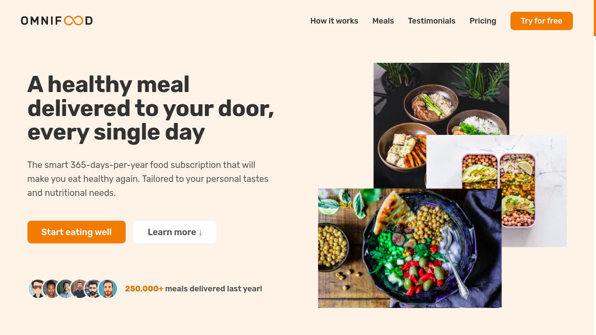

# Omnifood-Project

## It's amazing website built with HTML , CSS and javaScript

### [🔗 Live Demo link](https://omnifood-ahmed3zzeldeen.netlify.app/)

## Technologies I used :

- ### HTML , CSS , Flex-Box , CSS-Grid , Vanilla JavaScript

## Features :

- ### Responsive on Small Screens
- ### Responsive on large Screens
- ### Call To Action Forms

## Sections content :

<ol style="color:#fff; font-size:16px; font-weight:bold">
  <li>Hero section</li>
  <li>Featured in section</li>
  <li>How it works section</li>
  <li>Meals section</li>
  <li>Testimonials section</li>
  <li>Pricing section</li>
  <li>Call To Action section</li>
  <li>Footer</li>
</ol>
